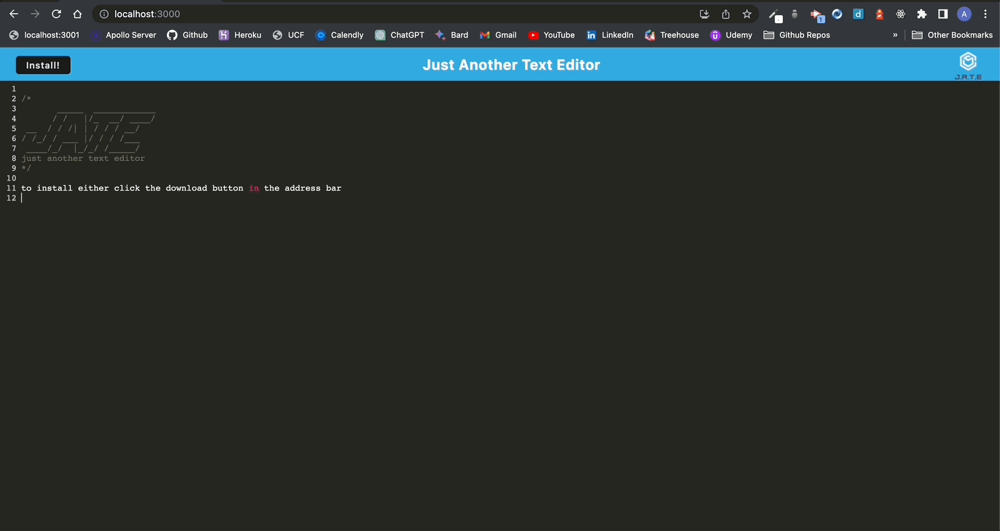

<link rel="stylesheet" href="https://cdn.jsdelivr.net/gh/devicons/devicon@v2.15.1/devicon.min.css">
<link rel="stylesheet" href="https://cdn.jsdelivr.net/gh/devicons/devicon@v2.15.1/devicon.min.css">
          
          
# J.A.T.E. (Just Another Text Editor) 

## Description
J.A.T.E, or "Just Another Text Editor", is a versatile, web-based text editor that enables users to easily create, edit, and save text files across various devices. As a Progressive Web App (PWA), J.A.T.E offers offline functionality, platform independence, and the capability to be installed on any device, ensuring constant access to your work. It blends the reliability of traditional text editors with the adaptability of modern web technologies, providing a user-friendly platform for all text editing needs. 
## Quick Links

- [Installation](#installation)
  
- [Usage](#usage)

- [Technologies](#technologies)

- [Demo](#demo)
  
- [Contributors](#contributors)
  
- [Feedback and Support](#feedback-and-support)
  
- [License](#license)

## Installation

To install and use this repo, please follow the below instructions:
- Pull the repository files to your local machine
- Open the repository in your code editor of choice
- Open the CLI terminal and run the command `npm install` to install the required dependencies
- Run the command `npm run build` to build the application
- Finally run the command `npm start` to start the server and run the application
- The application will be running on `http://localhost:3000/`

## Usage

To use the web based version no installation is required. Simply navigate to the deployed application [URL]() and begin using the app in your browser. J.A.T.E. is a Progressive Web App (PWA) and can be installed locally on any device. Simply click the install button in the address bar of your browser or in the top left corner of the page to install the application on your device.

## Technologies

<i class="devicon-webpack-plain-wordmark" style=font-size:9rem></i></img>
          

          

## Demo

 
          
          

Follow me to the [Deployed Application]()

## Contributors
Adam Brannon

[Check me out on Github](https://github.com/adam-brannon09)

[Email Me](mailto:adam.brannon09@icloud.com)

## Feedback and Support

If you encounter any issues while using the PWA Text Editor App or have any suggestions for improvement, please [open an issue](https://github.com/adam-brannon09/PWA_Text_Editor/issues) on the GitHub repository. I appreciate your feedback and will address any concerns as soon as possible.

## License

The PWA Text Editor Backend is released under the [MIT License](https://opensource.org/licenses/MIT). You are free to use, modify, and distribute this application as per the terms of this license.

    

